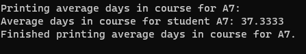

# c867-scripting-and-programming-applications

    
    Course Title: C867 - SCRIPTING AND PROGRAMMING - APPLICATIONS
    Programming Language: C++
    IDE: VISUAL STUDIO
    "WGU Student ID: 010195113
    AUTHOR: NICK MENSAH
    

## Outline

              [ X ] indicates complete

              File Name: #
              Line Number:  #
              Change:  #

## INTRODUCTION

    Throughout your career in software development, you will develop and maintain new and existing applications. 
    You will be expected to fix issues as well as add new enhancements or migrate existing applications to new platforms or different programming languages.
    As a software developer, your role will be to create a design of an application based on given business requirements.
    After the design is completed, you must implement the application based on the design document and provided requirements.

## A.  Modify the “studentData Table” to include your personal information as the last item.

              File Name: main.cpp
              Line Number:  1-31
              Change:  Modify Student Roster withe personal information

### Modified Roster and Sucessful Compilation

## B.  Create a C++ project in your integrated development environment (IDE) with the following files:

              File Name: main.cpp, degree.h, student.h, student.cpp, roster.h, roster.cpp 
              Line Number:  -
              Change:  Add files to complete section B

Note: There must be a total of six source code files.
- [X] degree.h 
- [X] student.h 
- [X] student.cpp
- [X] roster.h 
- [X] roster.cpp
- [X]  main.cpp

### Added files

## C.  Define an enumerated data type DegreeProgram for the degree programs containing the data type values SECURITY, NETWORK, and SOFTWARE.
Note: This information should be included in the degree.h file.

               File Name: degree.h
               Line Number:  1-14
               Change:  Defined enumerated data type DegreeProgram containg data types

### Defined Enumerated Data 

## D.  For the Student class, do the following:

### 1.  Create the class Student  in the files student.h and student.cpp, which includes each of the following variables:

-[X]  student ID

-[X]  first name

-[X]  last name

-[X]  email address

-[X]  age

-[X]  array of number of days to complete each course

-[X] degree program

      label files inorder to get file names easily 

      File Name: student.h, student.cpp
      Line Number:  1-28, 1-16
      Change:  Implement Student class with member variables, constructors

#### student.cpp, student.h C1

   

      <image src="./README-IMG/section-c-student-cpp.png" alt="c-student-cpp"/>
     <image src="./README-IMG/section-c-student-h.png" alt="c-student-h"/>
   

### 2.  Create each of the following functions in the Student class:

-[X] a.  an accessor (i.e., getter) for each instance variable from part D1

-[X] b.  a mutator (i.e., setter) for each instance variable from part D1

-[X] c.  All external access and changes to any instance variables of the Student class must be done using accessor and mutator functions.

-[X] d.  constructor using all of the input parameters provided in the table

  -[X] e.  print() to print specific student data

         File Name: student.h, student.cpp, degree.h
         Line Number:  26-48, 34 - 118, 14-16
         Change:   Complete implementation of the Student class:, 
           Added accessors and mutators for each instance variable, 
           Implemented constructor with all input parameters, 
           Added print() function to display student data, 
           degreeProgramToString function declaration

## E.  Create a Roster class (roster.cpp) by doing the following:

### 1.  Create an array of pointers, classRosterArray, to hold the data provided in the “studentData Table.”
### 2.  Create a student object for each student in the data table and populate classRosterArray.

-[X] a.  Parse each set of data identified in the “studentData Table.”
  -[X] b.  Add each student object to classRosterArray.

        File Name: roster.cpp, roster.h
        Line Number:  1-60, 1-23
        Change:   Parse student data and add students to classRosterArray in Roster class
                 - Updated Roster::parseAndAddStudent to parse student data from a string and add a Student object to classRosterArray.
                 - Updated Roster::addStudent to add a Student object to classRosterArray.
 
#### Test Roster

<image src="./README-IMG/test-add-roster.png"/>

### 3.  Define the following functions:

-[X]  a.  public void add(string studentID, string firstName, string lastName, string emailAddress, int age, int daysInCourse1, int daysInCourse2, int daysInCourse3, DegreeProgram degreeprogram)  that sets the instance variables from part D1 and updates the roster.

       File Name: roster.h, roster.cpp, main.cpp
       Line Number:  19/14, 59-61,  34-37
       Change: 3a-Updated Roster class to use std::vector<Student*> for dynamic storage, Removed redundant array-based functions, Implemented the `add` function to add new students to the roster, Updated usage of `classRosterArray.size()` to work with vectors, Added a new student A6 using the `add` function  

#### Test after switch to dynamic array(vector)
- nothing did not indicate the i could not use a dynamic array(vector) so i updated to add new student 

<image src="./README-IMG/using-vector.png" alt="using-vector"/>

-[X]  b.  public void remove(string studentID)  that removes students from the roster by student ID. If the student ID does not exist, the function prints an error message indicating that the student was not found.

        File Name: roster.h, roster.cpp, main.cpp
        Line Number:  35-37, 37-39, 44-49
        Change:  Declare remove function, implement the remove function, Add A7 student then remove as test

#### Test Add Removal of student

<image src="./README-IMG/Add-removal-test.png" alt="Add/Removal Test"/>

-[X]  c. public void printAll() that prints a complete tab-separated list of student data in the provided format: A1 [tab] First Name: John [tab] Last Name: Smith [tab] Age: 20 [tab]daysInCourse: {35, 40, 55} Degree Program: Security. The printAll() function should loop through all the students in classRosterArray and call the print() function for each student.

         File Name: main.cpp, roster.cpp, roster.h
         Line Number:  42/49, 58-60, 21-23 requirements after use for testing a light adjustment
         Change:  Refactor printAll() function and adjust return statement 

#### Refactor printAll() function and adjust return statement

<image src="./README-IMG/refactor-printall.png"/>

-[X]  d.  public void printAverageDaysInCourse(string studentID)  that correctly prints a student’s average number of days in the three courses. The student is identified by the studentID parameter.

        File Name: roster.h, roster.cpp, main.cpp
        Line Number:39-41,  100-116, 41-44
        Change:  Implement printAverageDaysInCourse function that correctly prints a student’s average number of days in the three courses identified by the studentID parameter.

#### Implement printAverageDaysInCourse function

-[X]  e.  public void printInvalidEmails() that verifies student email addresses and displays all invalid email addresses to the user.

        File Name: roster.h, roster.cpp, 
        Line Number:  43-44, 119-133, 49-53
        Change:  Implement printInvalidEmails function to validate and display invalid email addresses.
    - Note: A valid email should include an at sign ('@') and period ('.') and should not include a space (' ').

#### Implement printInvalidEmails Test

<image src="./README-IMG/invalid-email-2.png" alt="invalid-email-ide"/>
<image src="./README-IMG/invalid-email-1.png" alt="invalid-email-cli"/>

-[X] f.  public void printByDegreeProgram(DegreeProgram degreeProgram) that prints out student information for a degree program specified by an enumerated type.

        File Name: roster.h, roster.cpp, main.cpp
        Line Number:  47, 135-145, 57-62
        Change: Implement printByDegreeProgram() to display student information for a specified degree program. Handle invalid degrees and add test case for DegreeProgram::SOFTWARE.

#### Print By Software
<image src="./README-IMG/print-by-software.png"/>

## F.  Demonstrate the program’s required functionality by adding a main() function in main.cpp, which will contain the required function calls to achieve the following results:

### 1.  Print out to the screen, via your application, the course title, the programming language used, your WGU student ID, and your name.
### 2.  Create an instance of the Roster class called classRoster.
### 3.  Add each student to classRoster.
### 4.  Convert the following pseudo code to complete the rest of the  main() function:

    
    classRoster.printAll();
    
    classRoster.printInvalidEmails();
    
    
    
    //loop through classRosterArray and for each element:
    
    classRoster.printAverageDaysInCourse(/*current_object's student id*/);
    
    
    
    Note: For the current_object's student id, use an accessor (i.e., getter) for the classRosterArray to access the student id.
    
    
    
    classRoster.printByDegreeProgram(SOFTWARE);
    
    classRoster.remove("A3");
    
    classRoster.printAll();
    
    classRoster.remove("A3");
    
    //expected: the above line should print a message saying such a student with this ID was not found.
    
    

### 5.  Implement the destructor to release the memory that was allocated dynamically in Roster.

#### Demonstratethe Program Required Functionality

<image src="./README-IMG/demonstratethe-program-required-functionality.png" alt="demonstratethe-program-required-functionality"/>